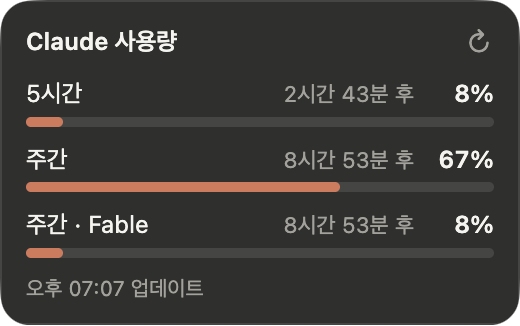

# ClaudeUsage

[](https://github.com/aodjo/ClaudeUsage/actions/workflows/build.yml)
[](https://github.com/aodjo/ClaudeUsage/releases/latest)
[](https://github.com/aodjo/ClaudeUsage/releases)
[](LICENSE)


Claude 요금제 사용량(5시간 한도, 주간 한도)을 화면 위에 띄워 두는 위젯입니다.



## Supported Languages
[English](README.en.md)

## 설치

[Releases](https://github.com/aodjo/ClaudeUsage/releases/latest)에서 운영체제에 맞는 파일을 받으세요.

| 운영체제 | 파일 |
|---|---|
| macOS (Apple Silicon) | `ClaudeUsage-mac-arm64.dmg` |
| macOS (Intel) | `ClaudeUsage-mac-x64.dmg` |
| macOS (둘 다 지원) | `ClaudeUsage-mac-universal.dmg` |
| Windows (x64) | `ClaudeUsage-win-x64.exe` |
| Windows (ARM) | `ClaudeUsage-win-arm64.exe` |
| Linux (x64) | `ClaudeUsage-linux-x86_64.AppImage` |
| Linux (ARM) | `ClaudeUsage-linux-arm64.AppImage` |

### 처음 실행할 때

코드 서명이 되어 있지 않아서 처음 실행할 때 경고가 뜹니다.

- **macOS**: dmg를 열어 ClaudeUsage를 응용 프로그램 폴더로 옮긴 뒤 실행하세요. "Apple이 확인할 수 없습니다"라는 창이 뜨면 **시스템 설정 → 개인정보 보호 및 보안**에서 **그래도 열기**를 누르세요. 터미널에서 아래 명령을 한 번 실행해도 됩니다.
  ```bash
  xattr -dr com.apple.quarantine /Applications/ClaudeUsage.app
  ```
- **Windows**: "Windows의 PC 보호" 창이 뜨면 **추가 정보 → 실행**을 누르세요.
- **Linux**: 실행 권한을 준 뒤 실행하세요. 실행되지 않으면 FUSE 2를 설치하세요(Ubuntu 22.04는 `libfuse2`, 24.04는 `libfuse2t64`).
  ```bash
  chmod +x ClaudeUsage-linux-*.AppImage
  ./ClaudeUsage-linux-x86_64.AppImage
  ```

## 사용법

실행하면 화면 오른쪽 위에 위젯이 뜹니다. Dock이나 작업 표시줄에는 나타나지 않습니다.

### 로그인

처음 실행하면 **claude.ai 로그인** 버튼이 보입니다. claude.ai 구독 계정(Pro, Max 등)으로 로그인하세요. 로그인 창에서는 패스키를 쓸 수 없으니 이메일로 로그인합니다.

1. **claude.ai 로그인** 버튼을 누릅니다.
2. 로그인 창에 이메일을 입력하고 이메일로 로그인을 선택합니다.
3. 받은 메일의 로그인 링크를 평소 쓰는 브라우저에서 열면 인증 코드가 표시됩니다.
4. 그 코드를 위젯의 로그인 창에 입력합니다. 로그인되면 창이 저절로 닫히고 사용량이 표시됩니다.

로그인은 위젯에만 저장되며 다시 실행해도 유지됩니다.

### 조작

| 하고 싶은 것 | 방법 |
|---|---|
| 위치 옮기기 | 위젯을 드래그합니다. 다음 실행 때도 그 자리에 뜹니다. |
| 바로 새로고침 | 오른쪽 위 ↻ 버튼을 누릅니다. 평소에는 2분마다 저절로 새로고침합니다. |
| 항상 위에 켜기/끄기 | 우클릭 → **항상 위에** |
| 로그아웃 | 우클릭 → **claude.ai 로그아웃** |
| 종료 | 우클릭 → **종료** |

- 막대는 75% 이상이면 노란색, 90% 이상이면 빨간색으로 바뀝니다.
- 남은 시간에 마우스를 올리면 정확한 초기화 시각이 보입니다.
- 로그인이 만료되면 **claude.ai 로그인** 버튼이 다시 나타납니다.
